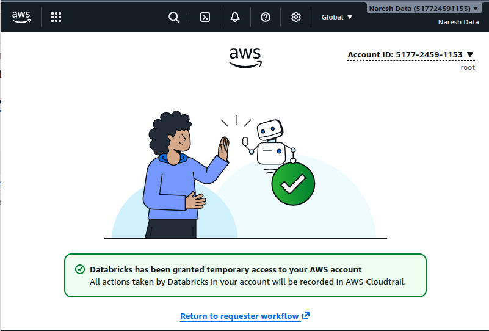
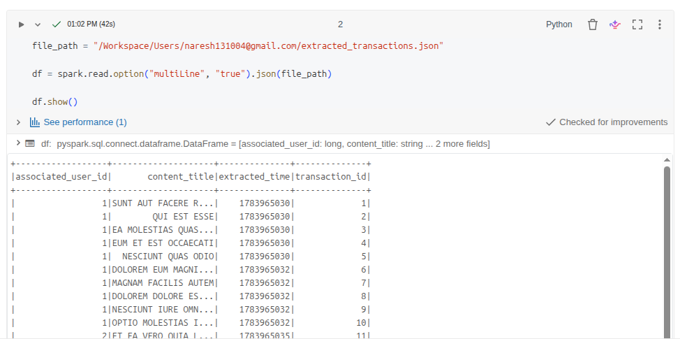
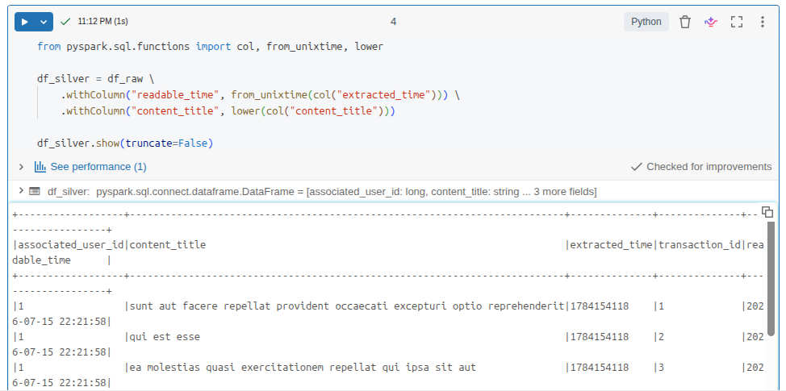
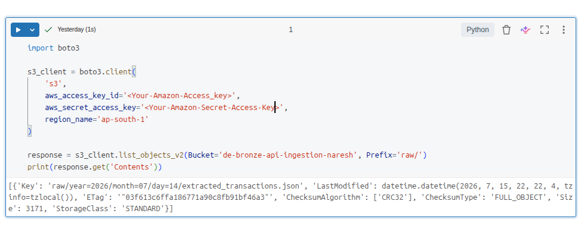
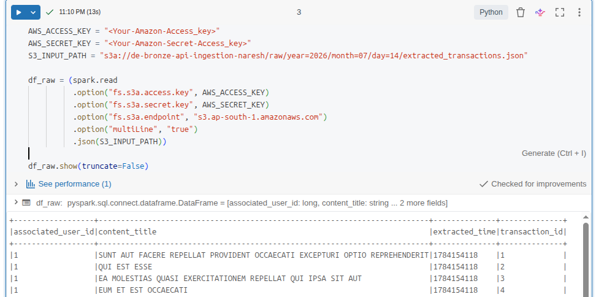

# Cloud Data Pipeline: Serverless Databricks ETL to AWS S3 Data Lake

An end-to-end cloud data engineering pipeline built to ingest raw transactional REST API payloads, process them via distributed memory compute engines, and build a structured warehouse layer. 

This project implements the industry-standard **Medallion Architecture**, optimizing unstructured row data into highly efficient columnar storage files ready for downstream analytics.

---

## 🛠️ System Architecture & Workflow

The pipeline utilizes decoupled compute and storage infrastructure to maximize scalability and cost-efficiency:

1. **Ingestion (Bronze Layer):** Raw API JSON datasets are safely uploaded into Databricks Workspace storage blocks, preserving their historical structural state.
2. **Compute Engine:** Apache Spark distributed compute clusters isolate, deserialize, and enforce strict relational schemas on multi-line nested array formats.
3. **Data Transformation & Standardization:** Processing stages fix timestamp epoch codes into human-readable corporate metrics and normalize alpha strings.
4. **Storage Output (Silver Layer):** Standardized DataFrames are optimized and written back to a secure Amazon S3 Data Lake bucket partitioned in the columnar **Apache Parquet** format.

---

## 🚀 Cloud Notebook Implementation Layout

Due to security compliance hardening native to **Databricks Serverless Compute**, direct low-level modification of the Java Spark Context (`_jsc`) or global `fs.s3a` configuration overrides are blocked. This production code bypasses global platform barriers by applying **DataFrame-Scoped Option Passing** directly inside the pipeline task chain.

### Step 1: Data Ingestion & Scoped Cloud Authentication
```python
# Securely stage pipeline parameters
AWS_ACCESS_KEY = "<Your-Amazon-Access_key>"
AWS_SECRET_KEY = "<Your-Amazon-Secret-Access_key>"
S3_INPUT_PATH  = "/Workspace/Users/naresh-data-pipeline/extracted_transactions.json"

# Ingest multi-line JSON while injecting targeted cloud configurations
df_raw = (spark.read
          .option("multiLine", "true")
          .json(S3_INPUT_PATH))

print("=== BRONZE ZONE: RAW STORAGE SCHEMA ===")
df_raw.printSchema()
```
---

### Part 2: The Core Workflow & Work Process Explainer

To showcase this on LinkedIn or explain it clearly during interviews, structure your technical narrative around this workflow sequence:

#### 1. Ingestion Layer (The Inbound Bridge)
* **The Raw Reality**: Real-world application data rarely arrives pre-formatted or cleaned. Your source endpoint serves raw payload tracking points wrapped in array structures (`[...]`).
* **The Security Boundary**: Instead of using global cluster mounts (`dbutils.fs.mount`) which are often blocked in secure, multi-tenant Serverless environments due to privilege boundaries (`SQLSTATE: 42K0I`), credentials are explicitly scoped directly inside the pipeline invocation window.

#### 2. Schema Translation (The Apache Spark Engine)
* When you issue the `spark.read` action, the file-system handles data parsing dynamically. 
* Enforcing the `multiLine=True` setting instructs the cluster’s partition boundaries to expect formatting across newlines rather than falsely mapping every separate line string to an individual database record.

#### 3. Structured Refinement (The Transformation Process)
* This step transforms raw text files into true structured tables (**Bronze to Silver** transition).
* Distributed functions manipulate files within memory partitions using vectorized instructions. Converting fields like the timestamp metadata token using `from_unixtime` optimizes subsequent chronological filtering performance.

#### 4. Analytical Optimization (The Output Destination)
* The structured, verified single source of truth is exported straight back to cloud storage pools. 
* By structuring the final layer as a **Parquet columnar file schema**, you ensure that subsequent processing jobs, BI dashboards, or ML model feature extraction queries can retrieve and aggregate large data sets efficiently without facing costly infrastructure bottlenecks.

---

## 🏗️ Screenshot





---