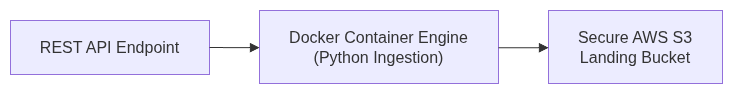

## ✨ Core Engineering Features

* **Automated Cursor Pagination:** Implements continuous, defensive `while True` extraction loops that dynamically increment URL indexing references (`_page`, `_limit`) to scale across thousands of records without data duplication or pipeline termination hang-ups.
* **Network Fault Tolerance:** Wrapped completely inside robust, targeted exception handling blocks (`requests.exceptions.RequestException`, `HTTPError`). The script handles sudden timeouts or API rate limits gracefully instead of experiencing sudden process failures.
* **Schema Enforcement & In-Line Data Quality Control:** Prior to cloud persistence, each incoming record must clear an automated validation scan confirming the presence of mandatory structural attributes (`id`, `userId`, `title`). Corrupt rows are isolated as logged warnings while healthy fields are scrubbed of excess string whitespace and capitalized.
* **Hive-Style Storage Partitioning Layout:** Rather than dumping objects arbitrarily into a directory folder, data is written natively using Hive partitions (`key=value`). This architecture facilitates **partition pruning** for downstream parallel big data tools like **Apache Spark** and **Databricks**, allowing query tasks to target narrow time horizons without initiating full-bucket storage sweeps.
* **Decoupled Infrastructure Security Architecture:** Keeps environment configurations, operational limits, and confidential IAM root access coordinate definitions completely isolated from core logic within a dedicated environment configuration bundle (`.env`), keeping source control clear of parameter visibility breaches.

---

## 🏗️ Architecture

*(Insert your diagram image here)*

---

## 🚀 Getting Started & Local Deployment

### Hardware & Software Prerequisites
* [Docker Desktop](https://www.docker.com/products/docker-desktop/) installed, configured, and with the daemon engine actively running on your local machine.
* An active [AWS Free Tier Cloud Account](https://aws.amazon.com/) with an IAM development user provisioned containing programmatic `AmazonS3FullAccess` policy authorization.

### 1. Project Directory Layout
Ensure your workspace matches this professional repository skeleton layout before compilation:
```text
core-data-ingestion/
├── logs/
│   └── pipeline.log             # Generated dynamically by the logger
├── Dockerfile                   # PORTABILITY BLUEPRINT
├── requirements.txt             # DEPENDENCY MATRIX
├── main.py                      # CORE LOGIC LAYER
├── .env                         # LOCAL SECRETS FILE (HIDDEN FROM GIT)
└── .gitignore                   # SECURE ENVIRONMENT REPO FIREWALL

### 2. Configure Environment Variables
Create a localized variable file within your absolute project path root:

Bash
touch .env
Open .env using your text editor and append your targeted API and cloud infrastructure keys:

Code snippet
API_TARGET_URL=[https://jsonplaceholder.typicode.com/posts](https://jsonplaceholder.typicode.com/posts)
MAX_PAGE_TO_FETCH=4
RECORDS_PER_PAGE=5
AWS_ACCESS_KEY_ID=your_programmatic_iam_access_key_id
AWS_SECRET_ACCESS_KEY=your_programmatic_iam_secret_access_key
AWS_BUCKET_NAME=your_globally_unique_s3_bucket_name
AWS_REGION=us-east-1
Note: Your .env and logs/ parameters are hardcoded within .gitignore to avoid pushing infrastructure variables to your public GitHub profile layout.

### 3. Build the Portable Container Engine
Compile your pipeline environment matrix into an immutable, portable Docker image layer:

Bash
docker build -t core-data-ingestion-engine .

### 4. Deploy and Initialize the Pipeline Runtime
Launch your data ingestion engine wrapper, mounting your environmental runtime variables straight into the container environment stack:

Bash
docker run --env-file .env core-data-ingestion-engine
📊 Observability & Monitoring
Pipeline performance, connection benchmarks, and skipped row counts are streamed concurrently to both your stdout console terminal layout and a structured local execution tracking file. Inspect the health state of your environment at any point using this trace command:

Bash
cat logs/pipeline.log
🗃️ Ingested Target Schema Structure
Data lands inside your specified cloud S3 bucket as an immutable historical tracking record (Bronze Quality Data Layer). The unstructured dictionary attributes are parsed down into a clean, normalized, ready-to-load JSON layout structure:

JSON
[
  {
    "transaction_id": 1,
    "associated_user_id": 1,
    "content_title": "CLEANED AND NORMALIZED UPCASE RECORD STRING",
    "extracted_time": 1781432400
  },
  {
    "transaction_id": 2,
    "associated_user_id": 1,
    "content_title": "SECURE PIPELINE FIELD DATA TYPE CASTING VALIDATION",
    "extracted_time": 1781432401
  }
]